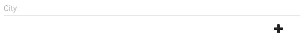
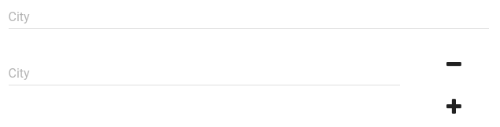

material-ui-repeatable
----------------------

Repeat any component as many times as you like on the page.

Single [TextField][text-field]



Multiple [TextField's][text-field]



# Installation

``` shell
yarn add material-ui-repeatable
```

Or with npm

```shell
npm i --save material-ui-repeatable
```

# Usage example

``` jsx
import React, { Component } from 'react';
import Repeatable from 'material-ui-repeatable';

class MyComponent extends Component {
    contructor() {
        super();
        this.state = {
            copies: 1
        };
    }

    repeat = (index) => (
        <div key={`replicant-${index}`}>hello, I am replicant {index}</div>
    )

    onAdd = (index) => {
        console.log('added replicant', index);
        this.setState({ copies: this.state.copies + 1 });
    }

    onRemove = (index) => {
        console.log('removed replicant', index);
        this.setState({ copies: this.state.copies - 1 });
    }

    render() {
        return (
            <Repeatable
              initialCopies={this.state.copies}
              childrenRenderer={this.repeat}
              onAdd={this.onAdd}
              onRemove={this.onRemove}
              />
        );
    }
}
```

# Properties

> For snackbar props please see [material-ui docs](http://www.material-ui.com/#/components/snackbar).

| Name | Type | Default | Description |
| ---- | ---- | ------- | ----------- |
| initialCopies | `number` | `1` | Number of the replicants to be generated at the render time. |
| requiredCopies | `number` | `1` | Number of the replicants that should be persist(remove control will hide when this value is reached). |
| childrenRenderer | `function` | `(index) => []` | A function that returns a new replicant. |
| onAdd | `function` | `(index) => undefined` | Function that will be invoked after some replicant added. |
| onRemove | `function` | `(index) => undefined` | Function that will be invoked after some replicant removed. |
| style | `object` | `{}` | Style of the component container. |

# License

[MIT](/LICENSE)


[text-field]: http://www.material-ui.com/#/components/text-field
